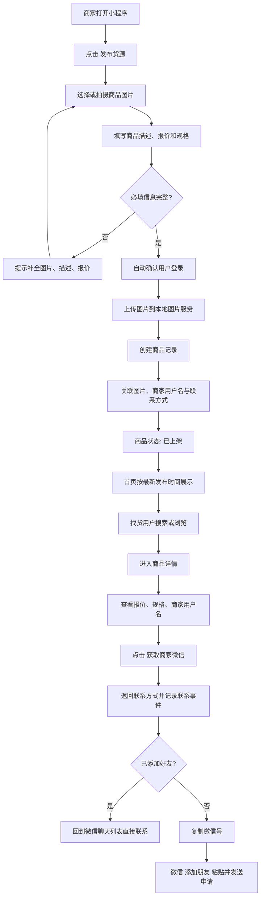

# 产品上传流程

```mermaid
flowchart TD
    A[商家打开小程序] --> B[点击 发布货源]
    B --> C[选择或拍摄商品图片]
    C --> D[填写商品描述、报价和规格]
    D --> E{必填信息完整?}
    E -- 否 --> F[提示补全图片、描述、报价]
    F --> C
    E -- 是 --> G[自动确认用户登录]
    G --> H[上传图片到本地图片服务]
    H --> I[创建商品记录]
    I --> J[关联图片、商家用户名与联系方式]
    J --> K[商品状态: 已上架]
    K --> L[首页按最新发布时间展示]
    L --> M[找货用户搜索或浏览]
    M --> N[进入商品详情]
    N --> O[查看报价、规格、商家用户名]
    O --> P[点击 获取商家微信]
    P --> Q[返回联系方式并记录联系事件]
    Q --> R{已添加好友?}
    R -- 是 --> S[回到微信聊天列表直接联系]
    R -- 否 --> T[复制微信号]
    T --> U[微信 添加朋友 粘贴并发送申请]
```
